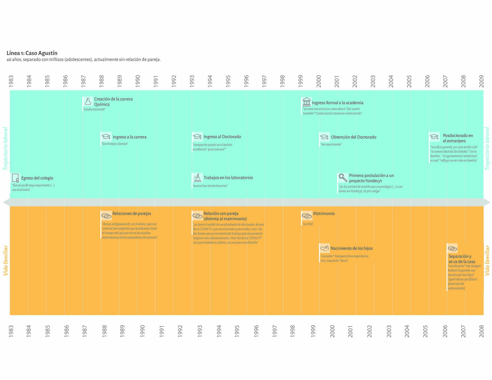
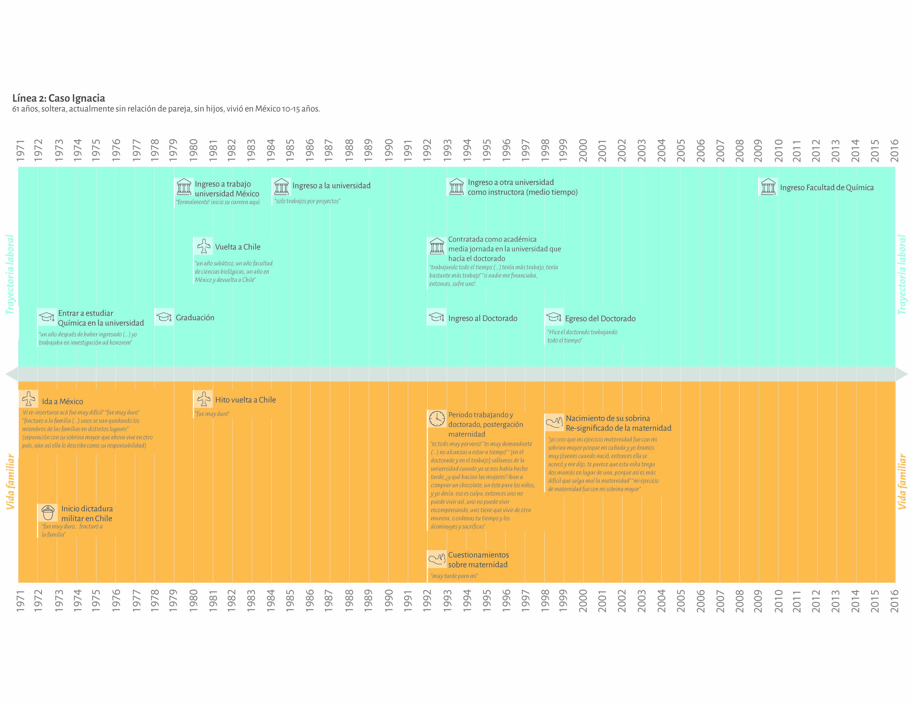
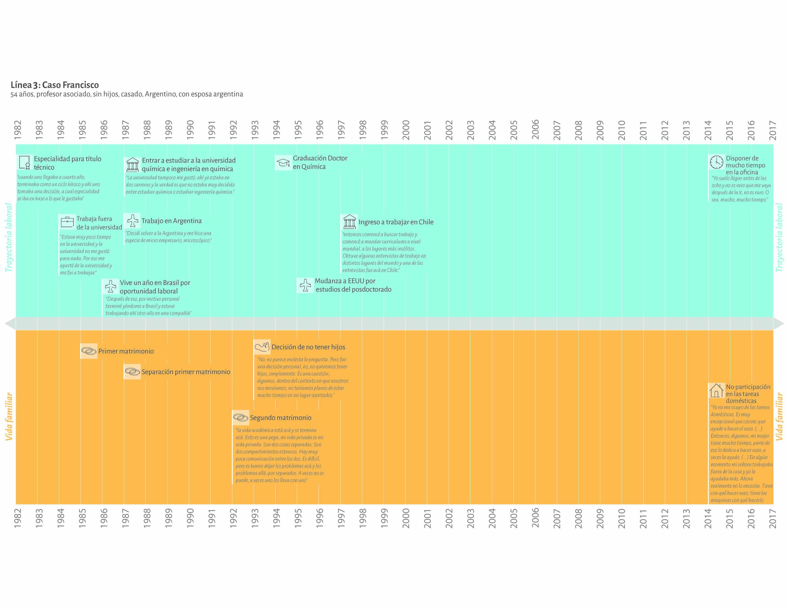
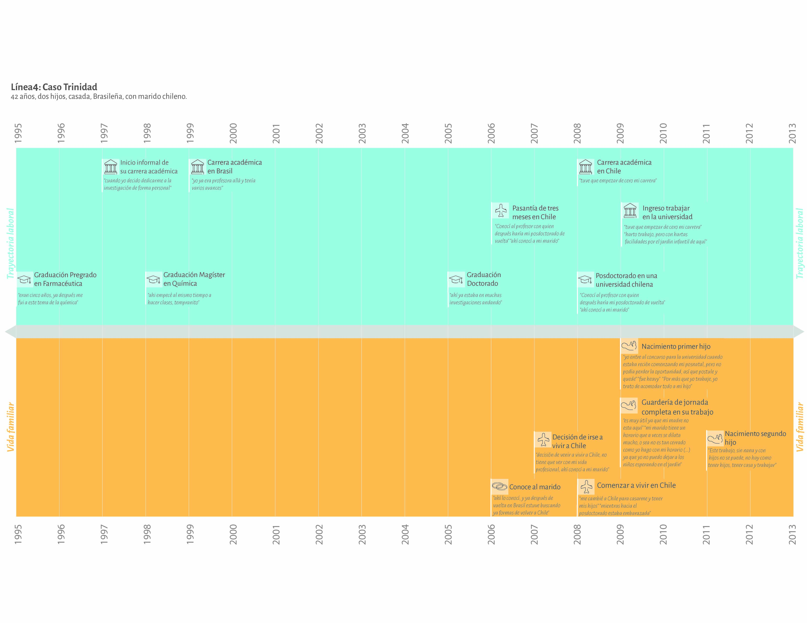

# Líneas de tiempo en la academia

En este repositorio se encuentran (en formato JPG y alta calidad) cuatro imagenes usadas en el artículo Ortiz, Francisca; Moyano, Camila y Moyano, Daniela (2020) "“Por más que yo trabaje, trato de acomodar todo a mi hijo”: Usos de la visualización de líneas de tiempo para comprender desigualdades de género en la academia" Revista CUHSO (en prensa):

- Línea 1: Caso de Agustín 
- Línea 2: Caso de Ignacia
- Línea 3: Caso de Francisco
- Línea 4: Caso de Trinidad

This repository  have (in JPG and high quality) four images used in the article done by Ortiz, Francisca; Moyano, Camila y Moyano, Daniela (2020) "“Even tough I work hard, I have to acomodate everything to my son”: Uses of visualization of timelines to comprenhend gender inequalities trough academia" Revista CUHSO (in press). 

- Timeline 1: Case study of Agustín 
- Timeline 2: Case study of Ignacia
- Timeline 3: Case study of Francisco
- Timeline 4: Case study of Trinidad

